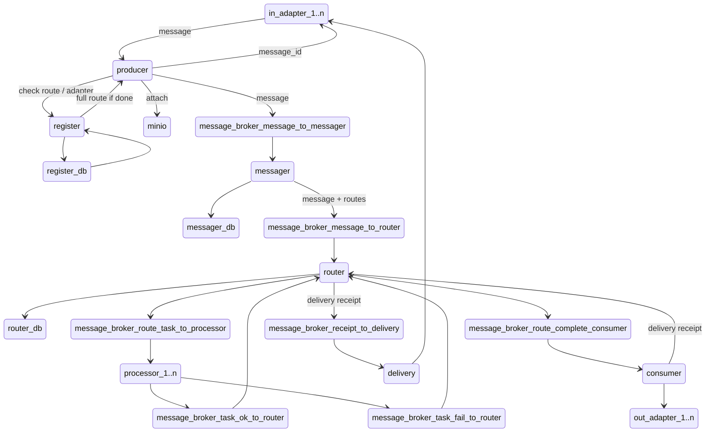

# databus
## corporate data bus

### map

### in_adapter_1..n
Входящие адаптеры- системы, "создающие" сообщения.
Должны знать маршрут, по которому они отправляют сообщение, а также семантику сообщения
Пример:
***in_adapter_from_folder*** - забирает все файлы из указанного каталога

### register
Сервис, позволяющий валидировать, может ли указанная система с указанным адаптером оптравлять сообщения по выбранному маршруту.
Также отвечает за регистрацию систем/адаптеров и маршрутов.

### маршрут
Список процессоров для обработки сообщения. Может быть пустым.
А также список получателей сообщения.

